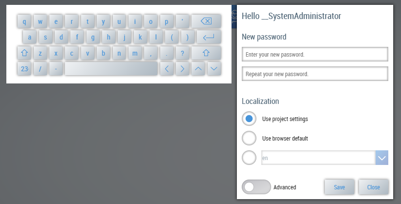
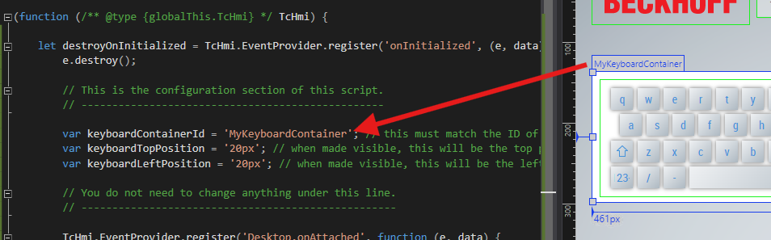

# Proof of concept, add keyboard to user management

## Disclaimer

This is a personal guide not a peer reviewed journal or a sponsored publication. We make
no representations as to accuracy, completeness, correctness, suitability, or validity of any
information and will not be liable for any errors, omissions, or delays in this information or any
losses injuries, or damages arising from its display or use. All information is provided on an as
is basis. It is the reader’s responsibility to verify their own facts.

The views and opinions expressed in this guide are those of the authors and do not
necessarily reflect the official policy or position of any other agency, organization, employer or
company. Assumptions made in the analysis are not reflective of the position of any entity
other than the author(s) and, since we are critically thinking human beings, these views are
always subject to change, revision, and rethinking at any time. Please do not hold us to them
in perpetuity.

## Overview

Currently TwinCAT hmi will open the User Management on a "top most layer". As such, this pushes any custom keyboards to the back and prevents the user from typing in text such as passwords. This example shows a workaround so that a keyboard can be added which appears on the same layer.

## Screenshot



## Steps to add to your own project

1. Copy & Paste the UserManagementKeyboardControl.js code from the example project to your project.
2. Copy & Paste the white container + keyboard from the example project Desktop.view to your own Desktop.view
3. Move the container off side of the view to hide it when not in use
4. Run the code in live view

You can use your own container and keyboard. Just ensure that the Id of your container matches the id in the script.



## Code snippet

Below is the extract of UserManagementKeyboardControl.js

```javascript
// Keep these lines for a best effort IntelliSense of Visual Studio 2017 and higher.
/// <reference path="./../../Packages/Beckhoff.TwinCAT.HMI.Framework.12.760.59/runtimes/native1.12-tchmi/TcHmi.d.ts" />

(function (/** @type {globalThis.TcHmi} */ TcHmi) {
  let destroyOnInitialized = TcHmi.EventProvider.register(
    "onInitialized",
    (e, data) => {
      e.destroy();

      // This is the configuration section of this script.
      // -------------------------------------------------

      var keyboardContainerId = "MyKeyboardContainer"; // this must match the ID of the container holding the keyboard control
      var keyboardTopPosition = "20px"; // when made visible, this will be the top position used
      var keyboardLeftPosition = "20px"; // when made visible, this will be the left position used

      // You do not need to change anything under this line.
      // ---------------------------------------------------

      TcHmi.EventProvider.register("Desktop.onAttached", function (e, data) {
        var theKeyboard = document.getElementById(keyboardContainerId);

        document.addEventListener("click", function (e) {
          var theTopLayer = $("#tchmi-system-topmostlayer-master").length
            ? $("#tchmi-system-topmostlayer-master")
            : $("#tchmi-system-top-layer-master");

          if (theTopLayer.length === 0) {
            return;
          }

          var validPlaceholders = [
            "Enter your password.",
            "Enter your current password.",
            "Enter your new password.",
            "Repeat your new password.",
            "Enter your user name.",
          ];

          if (validPlaceholders.includes(e.srcElement.placeholder)) {
            var index = theTopLayer[0].children.length == 1 ? 0 : 1;
            var theTopLayerContainer =
              theTopLayer[0].children[index].children[0];

            theKeyboard.style.top = keyboardTopPosition;
            theKeyboard.style.left = keyboardLeftPosition;
            theTopLayerContainer.appendChild(theKeyboard);
          }
        });
      });
    }
  );
})(TcHmi);
```

## Need more help?

Please visit http://beckhoff.com/ for further guides
